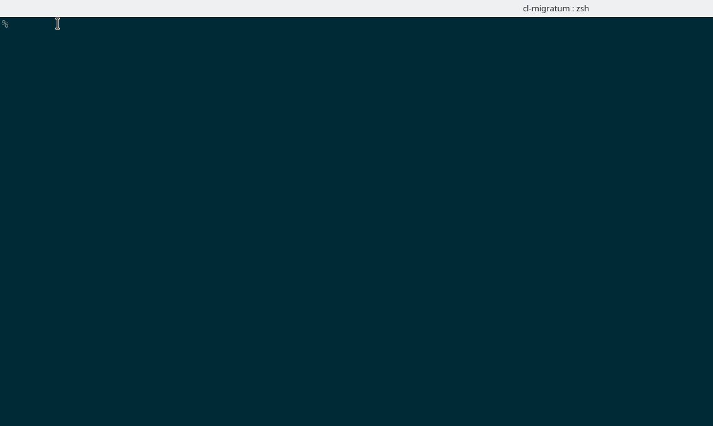

# Database Schema Migration System for Common Lisp

`cl-migratum` is a Common Lisp system, which provides facilities for
performing [database schema
migrations](https://en.wikipedia.org/wiki/Schema_migration).



## Requirements

* [Quicklisp](https://www.quicklisp.org/beta/)

## Systems

The following systems are available as part of this repo.

| System                                     | Description                                         |
|--------------------------------------------|-----------------------------------------------------|
| `cl-migratum`                              | Core system                                         |
| `cl-migratum.provider.local-path`          | Provider which discovers migrations from local-path |
| `cl-migratum.driver.dbi`                   | `cl-dbi` database driver                            |
| `cl-migratum.driver.rmdbs-postgresql`      | PostgreSQL driver based on `hu.dwim.rdbms`          |
| `cl-migratum.driver.postmodern-postgresql` | PostgreSQL driver based on `postmodern`             |
| `cl-migratum.driver.mixins`                | Various mixin classes used by drivers               |
| `cl-migratum.test`                         | Test suite for `cl-migratum`                        |
| `cl-migratum.cli`                          | CLI application of `migratum`                       |

## Installation

Installation is possible via [roswell](https://github.com/roswell/roswell). This will also build the `migratum` binary (see section CLI):

``` shell
ros install cl-migratum
```

The latest development version can be installed from the Git repo.

Clone the [cl-migratum](https://github.com/dnaeon/cl-migratum) repo in your
[Quicklisp local-projects directory](https://www.quicklisp.org/beta/faq.html).

``` shell
git clone https://github.com/dnaeon/cl-migratum.git
```

## CLI

You can install the CLI application of `migratum` by executing the
following command.

``` shell
make cli
```

The `migratum` binary will be built into the `bin/migratum`
directory. You can now install the binary somewhere in your `PATH`.

Once the `migratum` binary is built you can also generate the Zsh
completions by executing the following command.

``` shell
migratum zsh-completions > ~/.zsh-completions/_migratum
```

Make sure that `~/.zsh-completions` is part of your Zsh `FPATH`.

In order to generate the Markdown documentation of the CLI app use the
`cli-doc` target:

``` shell
make cli-doc
```

Or you can build a Docker image instead.

``` shell
docker build -t migratum.cli:latest -f Dockerfile.cli .
```

## Concepts

The `cl-migratum` system uses the following concepts to describe
the process of discovering and applying schema migrations, so it is
important that you get familiar with them first.

### Migration

A `migration` represents a resource that provides information about a
schema change, e.g. it provides the unique id of the change, the
required scripts that can be used to upgrade and/or downgrade the
database.

Migration resources are discovered via `providers` and are being
used by `drivers` during the upgrade or downgrade process.

### Provider

The `provider` is responsible for discovering migration resources.

For example a provider can discover migrations from a local path by
scanning for files that match a given pattern or fetch migrations from
a remote endpoint (e.g. HTTP service).

The `provider` is also responsible for creating new migration
sequences.

The following providers are supported by `cl-migratum`.

| Name         | Description                                                      | System                            |
|--------------|------------------------------------------------------------------|-----------------------------------|
| `local-path` | Provider that can discover migration resources from a local path | `cl-migratum.provider.local-path` |

### Driver

The `driver` carries out the communication with the database against
which schema changes will be applied.

It is responsible for applying schema changes, registering
successfully applied migrations and unregistering them when reverting
back to a previous state.

A `driver` internally uses a `provider` in order to discover
`migrations`, which can be applied against the database it is
connected to.

The following drivers are currently supported by `cl-migratum`.

| Name               | Description                                                                                                               | System                                | Migration Registration |
|--------------------|---------------------------------------------------------------------------------------------------------------------------|---------------------------------------|------------------------|
| `dbi`              | Driver for performing schema migrations against a SQL database using [CL-DBI](https://github.com/fukamachi/cl-dbi)        | `cl-migratum.driver.dbi`              | In table `migration`   |
| `rdbms-postgresql` | Driver for performing schema migrations against a SQL database using [hu.dwim.rdbms](http://dwim.hu/darcs/hu.dwim.rdbms/) | `cl-migratum.driver.rdbms-postgresql` | In table `migration`   |

## Usage

The following section contains some examples to get you started.

In order to use `cl-migratum` you will need to load the core system,
along with any `provider` and `driver` systems.

Load the core system.

``` shell
CL-USER> (ql:quickload :cl-migratum)
```

### Create Provider

First, we will create a new `provider` that can discover migration
files from a local path. In order to create a `local-path` provider we
need to load the respective system.

``` common-lisp
CL-USER> (ql:quickload :cl-migratum.provider.local-path)
```

Once you load the system we can create a `local-path` provider. The
`local-path` provider can discover migrations from multiple paths.

Typical example where having multiple paths with migration resources
might be useful is when you have a set of base migrations you want to
apply to all environments, and then have a separate path for each
environment with their own migrations. For example you might want to
run specific migrations only in your `dev` environment, but don't want
them in your `production` environment.

In that case it makes sense to separate the migration resources in
multiple paths, for each environment respectively.

``` common-lisp
CL-USER> (defparameter *provider*
           (migratum.provider.local-path:make-provider (list #P"/path/to/cl-migratum/t/migrations/")))
*PROVIDER*
```

The `LOCAL-PATH-PROVIDER` discovers migration files which match the
following pattern.

| Pattern                          | Description      |
|----------------------------------|------------------|
| `<id>-<description>.up.<kind>`   | Upgrade script   |
| `<id>-<description>.down.<kind>` | Downgrade script |

In above pattern `<id>` is a monotonically increasing integer, which
represents the timestamp the migration has been created. The format of
`<id>` is `YYYYMMDDHHMMSS`.

The supported migration kinds by `LOCAL-PATH-PROVIDER` are these.

| Extension | Kind    | Description                                      |
|-----------|---------|--------------------------------------------------|
| `.sql`    | `:sql`  | SQL migration resource                           |
| `.lisp`   | `:lisp` | Migration resource which invokes a Lisp function |

A provider can optionally be initialized, which can be done using the
`MIGRATUM:PROVIDER-INIT` generic function. Not all providers would
require initialization, but some will and therefore it is good that
you always initialize them first.

In order to list the migrations provided by a `provider` you can use
the `MIGRATUM:PROVIDER-LIST-MIGRATIONS` function, e.g.

``` common-lisp
CL-USER> (migratum:provider-list-migrations *provider*)
(#<CL-MIGRATUM.PROVIDER.LOCAL-PATH:LISP-MIGRATION {1004713F73}>
 #<CL-MIGRATUM.PROVIDER.LOCAL-PATH:SQL-MIGRATION {1004603BE3}>
 #<CL-MIGRATUM.PROVIDER.LOCAL-PATH:SQL-MIGRATION {1004603B03}>
 #<CL-MIGRATUM.PROVIDER.LOCAL-PATH:SQL-MIGRATION {10046039B3}>
 #<CL-MIGRATUM.PROVIDER.LOCAL-PATH:SQL-MIGRATION {1004603733}>)
```

The following generic functions can be used to interact with
discovered migrations.

| Method                           | Description                                                   |
|----------------------------------|---------------------------------------------------------------|
| `MIGRATUM:MIGRATION-ID`          | Returns the unique migration id                               |
| `MIGRATUM:MIGRATION-DESCRIPTION` | Returns the description of the migration                      |
| `MIGRATUM:MIGRATION-APPLIED`     | Returns the timestamp of when the migration was applied       |
| `MIGRATUM:MIGRATION-LOAD`        | Loads the `:up` or `:down` migration                          |
| `MIGRATUM:MIGRATION-KIND`        | Returns the kind of the migration, e.g. `:sql`, `:lisp`, etc. |

For example in order to collect the unique IDs of all migration
resources you can evaluate the following while at the REPL.

``` common-lisp
CL-USER> (mapcar #'migratum:migration-id
                 (migratum:provider-list-migrations *provider*))
(20200421180337 20200421173908 20200421173657 ...)
```

### Create Driver

Once we have a provider for discovering migration resources we need to
create a driver, which can be used to communicate with the database
we want to apply migrations on.

#### DBI Driver

Here is how we can create a `dbi` driver. First, lets load the system,
which provides that driver.

``` common-lisp
CL-USER> (ql:quickload :cl-migratum.driver.dbi)
```

The `dbi` driver uses [CL-DBI](https://github.com/fukamachi/cl-dbi)
interface to communicate with the database, so we will need to create
a database connection in order to initialize it.

``` common-lisp
CL-USER> (defparameter *conn*
           (dbi:connect :sqlite3 :database-name "/path/to/migratum.db"))
*CONN*
```

And now we can instantiate our SQL driver using the previously created
provider and connection.

``` common-lisp
CL-USER> (defparameter *driver*
           (migratum.driver.dbi:make-driver *provider* *conn*))
*DRIVER*
```

#### RDBMS PostgreSQL Driver

The process to create an `rdbms-postgresql` driver is analogous.  The
driver needs a connection specification to create a DB connection. In
this example we use the same environment variables which are used by
the PostgreSQL client `psql` to override the defaults:

``` common-lisp
(ql:quickload :cl-migratum.driver.rdbms-postgresql)
(defparameter *driver*
  (migratum.driver.rdbms-postgresql:make-driver
   *provider*
   `(:host ,(or (uiop:getenv "PGHOST") "localhost")
     :database ,(or (uiop:getenv "PGDATABASE") "migratum")
     :user-name ,(or (uiop:getenv "PGUSER") "migratum")
     :password ,(or (uiop:getenv "PGPASSWORD") "tiger"))))
```

### Initialization

A `driver` and `provider` may require some initialization steps to be
executed before being able to apply migrations, so make sure that you
initialize them.

In order to initialize your `provider` use the
`MIGRATUM:PROVIDER-INIT` function.

``` common-lisp
CL-USER> (migratum:provider-init *provider*)
```

An example requirement for a driver might be to create some required
database schema used to track which migrations have been applied
already, so lets initialize our driver first.

``` common-lisp
CL-USER> (migratum:driver-init *driver*)
```

### Pending Migrations

In order to get the list of pending (not applied yet) migrations we can
use the `MIGRATUM:LIST-PENDING` function, e.g.

``` common-lisp
CL-USER> (migratum:list-pending *driver*)
(#<CL-MIGRATUM.PROVIDER.LOCAL-PATH:SQL-MIGRATION {100363DFC3}>
 #<CL-MIGRATUM.PROVIDER.LOCAL-PATH:SQL-MIGRATION {100363E0A3}>
 #<CL-MIGRATUM.PROVIDER.LOCAL-PATH:SQL-MIGRATION {100363E183}>
 #<CL-MIGRATUM.PROVIDER.LOCAL-PATH:SQL-MIGRATION {100363E263}>
 #<CL-MIGRATUM.PROVIDER.LOCAL-PATH:LISP-MIGRATION {100363E343}>)
```

Or, we can display a table of the pending migrations using the
`MIGRATUM:DISPLAY-PENDING` function instead.

``` common-lisp
CL-USER> (migratum:display-pending *driver*)
.---------------------------------------------.
|             PENDING MIGRATIONS              |
+----------------+---------------------+------+
| ID             | DESCRIPTION         | KIND |
+----------------+---------------------+------+
| 20200421173657 | create_table_foo    | SQL  |
| 20200421173908 | create_table_bar    | SQL  |
| 20200421180337 | create_table_qux    | SQL  |
| 20200605144633 | multiple_statements | SQL  |
| 20220327224455 | lisp_code_migration | LISP |
+----------------+---------------------+------+
|                | TOTAL               |    5 |
+----------------+---------------------+------+
NIL
```

The migrations will be sorted in the order they need to be applied.

### Applying Migrations

The following functions are used for applying pending migrations.

* `MIGRATUM:APPLY-PENDING` - applies all pending migrations
* `MIGRATUM:APPLY-NEXT` - applies the next pending migration

This is how we can apply all pending migrations for example.

``` common-lisp
CL-USER> (migratum:apply-pending *driver*)
 <INFO> [21:20:51] cl-migratum.core core.lisp (apply-pending base-driver) -
  Found 5 pending migration(s) to be applied
 <INFO> [21:20:51] cl-migratum.core core.lisp (apply-and-register base-driver) -
  Applying migration 20200421173657 - create_table_foo (SQL)
 <INFO> [21:20:51] cl-migratum.core core.lisp (apply-and-register base-driver) -
  Applying migration 20200421173908 - create_table_bar (SQL)
 <INFO> [21:20:51] cl-migratum.core core.lisp (apply-and-register base-driver) -
  Applying migration 20200421180337 - create_table_qux (SQL)
 <INFO> [21:20:51] cl-migratum.core core.lisp (apply-and-register base-driver) -
  Applying migration 20200605144633 - multiple_statements (SQL)
 <INFO> [21:20:51] cl-migratum.core core.lisp (apply-and-register base-driver) -
  Applying migration 20220327224455 - lisp_code_migration (LISP)
NIL
```

### Get Latest Migration

You can use the `MIGRATUM:LATEST-MIGRATION` function to get the latest
applied migration, e.g.

``` common-lisp
CL-USER> (migratum:migration-id (migratum:latest-migration *driver*))
20220327224455 (45 bits, #x1263E96BE487)
```

The `MIGRATUM:CONTAINS-APPLIED-MIGRATIONS-P` predicate can be used to
query whether there are any migrations applied, e.g.

``` common-lisp
CL-USER> (migratum:contains-applied-migrations-p *driver*)
T
```

### Displaying Applied Migrations

The following functions can be used to get and display the
list of applied database migrations.

| Function                       | Description                            |
|--------------------------------|----------------------------------------|
| `MIGRATUM:DRIVER-LIST-APPLIED` | Returns the list of applied migrations |
| `MIGRATUM:DISPLAY-APPLIED`     | Display a table of applied migrations  |

This is how we can get the list of applied migrations.

``` common-lisp
CL-USER> (migratum:driver-list-applied *driver*)
(#<CL-MIGRATUM.CORE:BASE-MIGRATION {1002175993}>
 #<CL-MIGRATUM.CORE:BASE-MIGRATION {10021759D3}>
 #<CL-MIGRATUM.CORE:BASE-MIGRATION {1002175A13}>
 #<CL-MIGRATUM.CORE:BASE-MIGRATION {1002175A53}>
 #<CL-MIGRATUM.CORE:BASE-MIGRATION {1002175A93}>)
```

Or we can display a nice table of the applied migrations instead.

``` common-lisp
CL-USER> (migratum:display-applied *driver*)
.-------------------------------------------------------------------.
|                        APPLIED MIGRATIONS                         |
+----------------+---------------------+---------------------+------+
| ID             | DESCRIPTION         | APPLIED             | KIND |
+----------------+---------------------+---------------------+------+
| 20220327224455 | lisp_code_migration | 2022-03-29 18:20:53 | LISP |
| 20200605144633 | multiple_statements | 2022-03-29 18:20:51 | SQL  |
| 20200421180337 | create_table_qux    | 2022-03-29 18:20:51 | SQL  |
| 20200421173908 | create_table_bar    | 2022-03-29 18:20:51 | SQL  |
| 20200421173657 | create_table_foo    | 2022-03-29 18:20:51 | SQL  |
+----------------+---------------------+---------------------+------+
|                |                     | TOTAL               |    5 |
+----------------+---------------------+---------------------+------+
NIL
```

The output of these functions will be the applied migrations in
descending order by their id, first one being the most recent one.

The `dbi` and `rdbms-postgresql` drivers by default will fetch the
last 100 applied migrations. You can control this behaviour by using
the `:offset` and `:limit` keyword parameters, which allows you to
fetch applied migrations in pages.

For example, if you are interested only in the last ten applied
migrations you can evaluate the following expression.

``` common-lisp
CL-USER> (migratum:display-applied *driver* :limit 10)
```

Or if you want to skip the first ten migrations, you can evaluate
this expression instead.

``` common-lisp
CL-USER> (migratum:display-applied *driver* :offset 10 :limit 10)
```

### Stepping through migrations

Using the following functions you can step through migrations.

| Function               | Description                          |
|------------------------|--------------------------------------|
| `MIGRATUM:APPLY-NEXT`  | Apply the next pending migration(s)  |
| `MIGRATUM:REVERT-LAST` | Revert the last applied migration(s) |

This is useful in situations when you don't want to apply
all migrations at once, but rather do it one at a time. Both of these
functions accept a keyword parameter `:count` which specifies the
number of migrations to apply or revert.

Consider the following pending migrations.

``` common-lisp
CL-USER> (migratum:display-pending *driver*)
.---------------------------------------------.
|             PENDING MIGRATIONS              |
+----------------+---------------------+------+
| ID             | DESCRIPTION         | KIND |
+----------------+---------------------+------+
| 20200421173657 | create_table_foo    | SQL  |
| 20200421173908 | create_table_bar    | SQL  |
| 20200421180337 | create_table_qux    | SQL  |
| 20200605144633 | multiple_statements | SQL  |
| 20220327224455 | lisp_code_migration | LISP |
+----------------+---------------------+------+
|                | TOTAL               |    5 |
+----------------+---------------------+------+
NIL
```

We can apply them one by one and verify them as we go.

``` common-lisp
CL-USER> (migratum:apply-next *driver*)
 <INFO> [21:25:45] cl-migratum.core core.lisp (apply-and-register base-driver) -
  Applying migration 20200421173657 - create_table_foo (SQL)
NIL
CL-USER> (migratum:apply-next *driver*)
 <INFO> [21:25:47] cl-migratum.core core.lisp (apply-and-register base-driver) -
  Applying migration 20200421173908 - create_table_bar (SQL)
NIL
CL-USER> (migratum:apply-next *driver*)
 <INFO> [21:25:48] cl-migratum.core core.lisp (apply-and-register base-driver) -
  Applying migration 20200421180337 - create_table_qux (SQL)
NIL
CL-USER> (migratum:apply-next *driver*)
 <INFO> [21:25:49] cl-migratum.core core.lisp (apply-and-register base-driver) -
  Applying migration 20200605144633 - multiple_statements (SQL)
NIL
CL-USER> (migratum:apply-next *driver*)
 <INFO> [21:25:50] cl-migratum.core core.lisp (apply-and-register base-driver) -
  Applying migration 20220327224455 - lisp_code_migration (LISP)
NIL
```

If we want to revert the last three migrations we can use the
`MIGRATUM:REVERT-LAST` function, e.g.

``` common-lisp
CL-USER> (migratum:revert-last *driver* :count 3)
 <INFO> [21:26:14] cl-migratum.core core.lisp (revert-and-unregister base-driver) -
  Reverting migration 20220327224455 - lisp_code_migration (LISP)
 <INFO> [21:26:14] cl-migratum.core core.lisp (revert-and-unregister base-driver) -
  Reverting migration 20200605144633 - multiple_statements (SQL)
 <INFO> [21:26:14] cl-migratum.core core.lisp (revert-and-unregister base-driver) -
  Reverting migration 20200421180337 - create_table_qux (SQL)
NIL
```

Now, we should have 3 pending migrations again.

``` common-lisp
CL-USER> (migratum:display-pending *driver*)
.---------------------------------------------.
|             PENDING MIGRATIONS              |
+----------------+---------------------+------+
| ID             | DESCRIPTION         | KIND |
+----------------+---------------------+------+
| 20200421180337 | create_table_qux    | SQL  |
| 20200605144633 | multiple_statements | SQL  |
| 20220327224455 | lisp_code_migration | LISP |
+----------------+---------------------+------+
|                | TOTAL               |    3 |
+----------------+---------------------+------+
NIL
```

### Creating New Migrations

The `MIGRATUM:PROVIDER-CREATE-MIGRATION` generic function creates a
new migration sequence. The arguments it expects are the `direction`
(e.g. `:up` or `:down`), the migration `kind` (e.g. `:sql`, `:lisp`,
etc.), an instance of a `provider`, `id`, `description` and `content`.

Knowing `migratum:provider-create-migration` by the documentation 
below, you can also use the wrapper 
`migratum.provider.local-path:touch-migration` to create a pair of 
up-and-down empty migrations with a `LOCAL-PATH` provider.

#### SQL migrations

Here's an example of using the `LOCAL-PATH` provider for creating a
new SQL migration.

``` common-lisp
CL-USER> (defparameter *migration-id* (migratum:make-migration-id))
*MIGRATION-ID*
CL-USER>
CL-USER> (migratum:provider-create-migration
          :up            ;; <- direction
          :sql           ;; <- kind
          *provider*     ;; <- provider
          *migration-id* ;; <- the migration id
          "fubar"        ;; <- description
          "CREATE ...")  ;; <- contents
#<CL-MIGRATUM.PROVIDER.LOCAL-PATH:SQL-MIGRATION {1009570AD3}>
```

The downgrade migration is created in a similar way. Simply use the
`:down` direction and the appropriate contents for it. Also, make sure
that the description and id are the same when creating a pair of
upgrade/downgrade migrations.

#### Lisp migrations

The `:lisp` migration kind allows invoking a handler, which performs
the upgrade and downgrade.

The handler is a regular Lisp function, which accepts a single
argument that is an instance of a `driver`.

In order to create a `:lisp` migration you need to create a spec,
which specifies the Common Lisp `system`, `package`, `upgrade` and
`downgrade` handler.

Here's an example of a spec, which is a regular property list.

``` common-lisp
(:system :my-system :package :my-system.package :handler :upgrade-handler)
```

And here's a full example of creating an `:up` and `:down` migration.

``` common-lisp
CL-USER> (let ((id (migratum:make-migration-id))
               (desc "my lisp migration")
               (up-spec '(:system :my-system
                          :package :my-system.package
                          :handler :upgrade-handler))
               (down-spec '(:system :my-system
                            :package :my-system.package
                            :handler :downgrade-handler)))
           (values
            (migratum:provider-create-migration :up :lisp *provider* id desc up-spec)
            (migratum:provider-create-migration :down :lisp *provider* id desc down-spec)))
#<CL-MIGRATUM.PROVIDER.LOCAL-PATH:LISP-MIGRATION {100A39C083}>
#<CL-MIGRATUM.PROVIDER.LOCAL-PATH:LISP-MIGRATION {100A39D6C3}>
```

### Multiple SQL Statements

If you need to run multiple SQL statements when using the `dbi` or
`rdbms-postgresql` driver you can separate each statement in the
migration using the `--;;` separator.

The following example migration would create two tables as part of a
single transaction.

``` sql
CREATE TABLE foo (
    id INTEGER PRIMARY KEY
);
--;;
CREATE TABLE bar (
    id INTEGER PRIMARY KEY
);
```

### Debug logging

`cl-migratum` uses [log4cl](https://github.com/sharplispers/log4cl),
so you can enable debug logging, if needed.

``` common-lisp
CL-USER> (log:config :debug)
```

### Shutdown / Teardown

Once done with the migrations you should call the cleanup functions of
the `provider` and `driver`.

``` common-lisp
CL-USER> (migratum:provider-shutdown *provider*)
CL-USER> (migratum:driver-shutdown *driver*)
```

## Implemeting new migration resources

Generally new migration resources will be implemented along with a
`provider`, which discovers them.

You can implement a new migration resource by inheriting from the
`MIGRATUM:BASE-MIGRATION` class.

The following generic functions should be implemented on the newly
defined class.

| Method                    | Description                         |
|---------------------------|-------------------------------------|
| `MIGRATUM:MIGRATION-LOAD` | Loads the `:up` and `:down` scripts |
| `MIGRATUM:MIGRATION-KIND` | Returns the kind of the migration   |

The following generic functions can be overriden, if needed.

| Method                           | Description                                         |
|----------------------------------|-----------------------------------------------------|
| `MIGRATUM:MIGRATION-ID`          | Returns the unique migration id                     |
| `MIGRATUM:MIGRATION-DESCRIPTION` | Returns description of the migration                |
| `MIGRATUM:MIGRATION-APPLIED`     | Returns timestamp of when the migration was applied |

Example implementation that loads migration resources from a remote
HTTP server might look like this. The following code uses
[Dexador](https://github.com/fukamachi/dexador) as the HTTP client.

``` common-lisp
(defun http-get (url)
  "HTTP GETs the given URL"
  (let ((contents (dex:get url :force-string t)))
    contents))

(defclass http-migration (base-migration)
  ((up-script-url
    :initarg :up-script-url
    :initform (error "Must specify URL to upgrade script")
    :accessor http-migration-up-script-url
    :documentation "URL to the upgrade script")
   (down-script-url
    :initarg :down-script-url
    :initform (error "Must specify URL to downgrade script")
    :accessor http-migration-down-script-url
    :documentation "URL to the downgrade script"))
  (:documentation "HTTP migration resource"))

(defmethod migration-load ((direction (eql :up)) (migration http-migration))
  (http-get (http-migration-up-script-url migration)))

(defmethod migration-load ((direction (eql :down)) (migration http-migration))
  (http-get (http-migration-down-script-url migration)))
```

A provider should simply `MAKE-INSTANCE` of the `HTTP-MIGRATION` class by
providing values for the required slots while discovering migrations via
the `PROVIDER-LIST-MIGRATIONS` function.

## Implementing new providers

You can implement custom `providers`, which can discover migration
resources from various sources, e.g. local path, remote HTTP endpoints,
etc.

Each `provider` determines the rules, which identify a resource as a
valid migration, so custom logic for discovering them can be
implemented by using your own provider. For example the `local-path`
provider considers files to be valid migrations, if they match a given
regex pattern.

In order to create a new provider you should inherit from the
`MIGRATUM:BASE-PROVIDER` class and implement the following generic
functions on your newly defined class.

| Method                               | Description                                |
|--------------------------------------|--------------------------------------------|
| `MIGRATUM:PROVIDER-LIST-MIGRATIONS`  | Responsible for discovering migrations     |
| `MIGRATUM:PROVIDER-CREATE-MIGRATION` | Creates a new migration using the provider |

The following methods can be overriden, if needed.

| Method                          | Description                                                  |
|---------------------------------|--------------------------------------------------------------|
| `MIGRATUM:PROVIDER-NAME`        | Returns a human-friendly name of the provider                |
| `MIGRATUM:PROVIDER-INIT`        | Initializes the provider, if needed                          |
| `MIGRATUM:PROVIDER-INITIALIZED` | Returns `T` if provider is initialized, `NIL` otherwise      |
| `MIGRATUM:PROVIDER-SHUTDOWN`    | Shutdowns the provider and cleans up any allocated resources |

You can also check the [local-path
provider](./src/provider/local-path.lisp) implementation for some
example code.

## Implementing new drivers

A `driver` is responsible for communicating with the database we are
migrating and executes the upgrade and downgrade scripts.

The driver also takes care of registering applied migrations after
applying an upgrade script and also unregistering them during
downgrade, thus it is the drivers' decision how to implement
registering and unregistering. For example the `dbi` builtin driver
registers applied migrations in the same database it is migrating, but
a custom driver could choose a different stategy instead, e.g. use a
key/value store, local files, or some remote endpoint instead.

New drivers can be implemented by inheriting from the
`MIGRATUM:BASE-DRIVER` class. The following methods should be
implemented on new drivers.

| Method                               | Description                                            |
|--------------------------------------|--------------------------------------------------------|
| `MIGRATUM:DRIVER-LIST-APPLIED`       | Returns the list of applied migrations                 |
| `MIGRATUM:DRIVER-REGISTER-MIGRATION` | Registers/unregister a successfully applied migration  |
| `MIGRATUM:DRIVER-APPLY-MIGRATION`    | Applies a migration according to the given `direction` |

The following methods can be overriden, if needed.

| Method                        | Description                                                |
|-------------------------------|------------------------------------------------------------|
| `MIGRATUM:DRIVER-INIT`        | Initializes the driver, if needed                          |
| `MIGRATUM:DRIVER-NAME`        | Returns the human-friendly name of the driver              |
| `MIGRATUM:DRIVER-PROVIDER`    | Returns the `provider` used by the `driver`                |
| `MIGRATUM:DRIVER-INITIALIZED` | Returns `T` if driver is initialized, `NIL` otherwise      |
| `MIGRATUM:DRIVER-SHUTDOWN`    | Shutdowns the driver and cleans up any allocated resources |

You can check the [dbi driver](./src/driver/dbi.lisp) implementation
for some example code.

Additional methods can also be overriden, if needed. For example if
you need to have a different representation for the pending migrations
you can override the `MIGRATUM:DISPLAY-PENDING` method.

## Tests

Tests are provided as part of the `cl-migratum.test` system.

In order to run the tests you can execute.

``` common-lisp
make test
```

Or you can run the tests in a Docker container instead.

## Contributing

`cl-migratum` is hosted on
[Github](https://github.com/dnaeon/cl-migratum). Please contribute by
reporting issues, suggesting features or by sending patches using pull
requests.

## Authors

* Marin Atanasov Nikolov (dnaeon@gmail.com)

## License

This project is Open Source and licensed under the [BSD
License](http://opensource.org/licenses/BSD-2-Clause).
